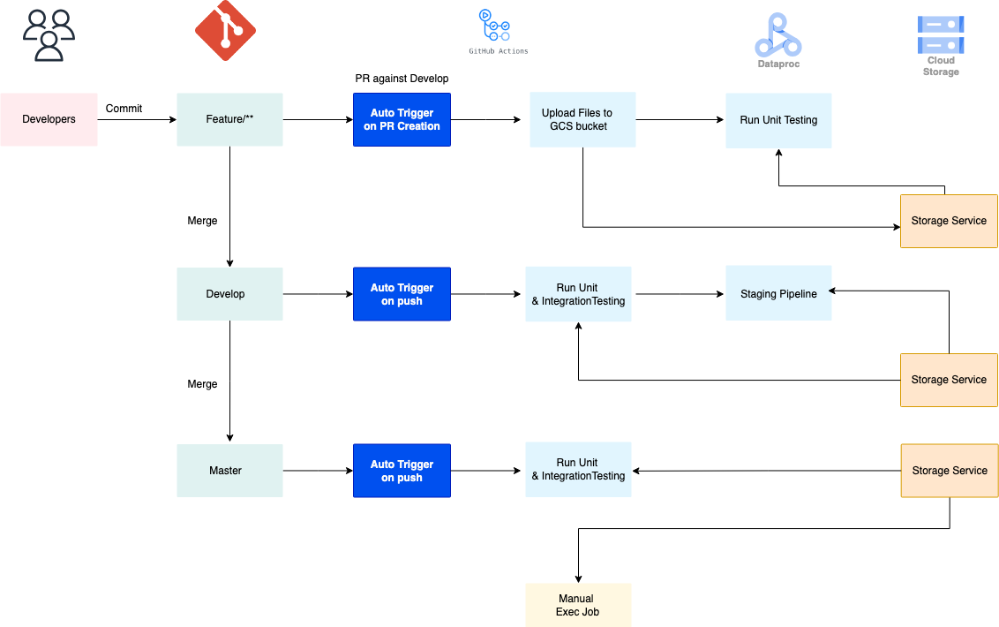

# Pyspark-project

PySpark data pipeline is a CI/CD project for PySpark applications on the GCP platform. It features CI/CD integration for automatic deployment and testing across staging and production environments, leveraging GitHub Actions for CI/CD.

# Solution Architecture

* Trigger a GitHub action workflow upon creation of a PR againts the `develop` branch. This action will upload test files & batch jobs to GCS bucket and initiates unit testing on a dataproc cluster. 

* When code is merged to develop branch, GitHub action workflow automatically trigger unit and integration tests, followed by running the batch job in the staging dataproc cluster.

* After merging it to master, GitHub action workflow triggers unit and integration testing to ensure quality. Manual execution of job in the production dataproc cluster.

## Security & Access Control

### Service Accounts

| Service Account | Permisssions                   |
| --------------- |:-------------------------------|
| wkf-oidc        | Workload Identity User         |
|                 | Service Account Token Creator  | 
|                 | Dataproc Editor                |
|                 | BigQuery Job User              |
|                 | BigQuery Data Editor           |
|                 | Storage Object Admin           |

### Google Cloud & GitHub Keyless Authentication

The GitHub action authenticates to google cloud via the `Workload Identity Federation` is recomended over the service account keys that needs to exported to GitHub secrets which is long-lived. 

With GitHub's introudction of OIDC tokens into GitHub action workflows, that enables the user to authenticate from GitHub actions to Google Cloud using `Workload Identity Federation`, by removing the need to long-lived service account key.

[Workload Identity Federation through a Service Account](https://github.com/google-github-actions/auth?tab=readme-ov-file#workload-identity-federation-through-a-service-account)
